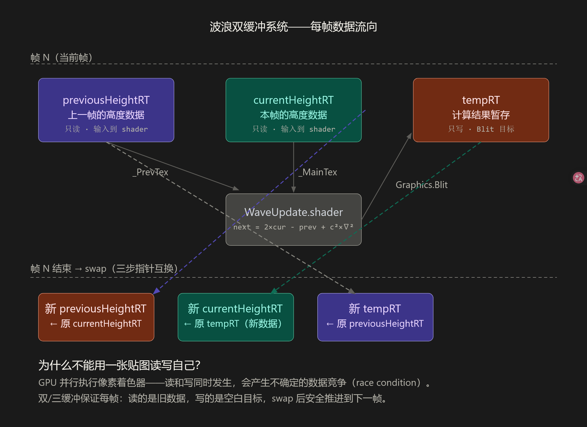
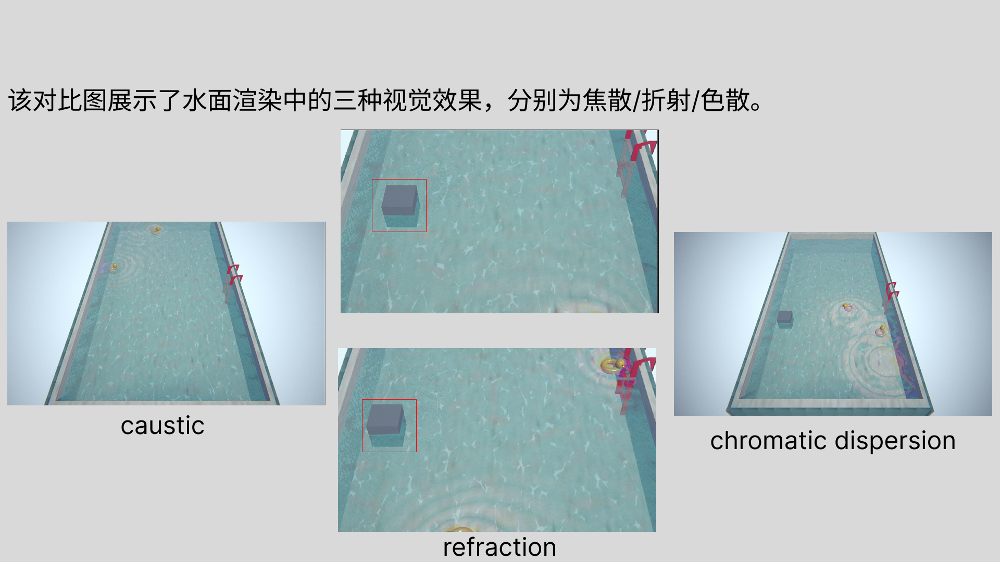

# Interactive Water Surface

[English](README.md) | [简体中文](README.zh-CN.md)

A Unity URP technical art study featuring real-time interactive ripples, foam injection, refraction, chromatic dispersion, caustics, and stylized pool look development.

## Preview

<!-- Upload an MP4 through GitHub's Markdown editor and paste the generated attachment URL here. -->
https://github.com/user-attachments/assets/20fed316-5417-4e66-908b-0c27f84f8f84


## Overview

This project explores a real-time interactive water system built with RenderTexture simulation, Shader Graph, and C#.

Mouse clicks or scene interactors can inject disturbances into the water surface, producing expanding ripples and localized foam. The resulting height data is converted into interaction normals and masks, then combined with the base water shading, refraction, chromatic dispersion, caustics, and post-processing to create a dreamy pool scene.

## Highlights

- Real-time ripple simulation using rotating RenderTextures
- Click and object interaction through ripple and foam injection
- Height-map-to-normal conversion using four-neighbor sampling
- Depth-based shallow and deep water color
- Dual scrolling normal maps and procedural vertex waves
- Interaction-driven refraction and chromatic dispersion
- Separate foam simulation affecting color, normal, and smoothness
- Caustics overlay and URP post-processing

## Technical Breakdown

### RenderTexture Wave Simulation

The wave simulation uses three RenderTextures:

- `previousHeightRT` - previous-frame height data
- `currentHeightRT` - current height data
- `tempRT` - write target for the next frame

Each update reads the current and previous states, writes the next result into `tempRT`, and then swaps the C# references. The textures remain in GPU memory; only their roles are exchanged.

<p align="center">
  
</p>

<p align="center"><em>Previous state + current state → wave update → reference swap</em></p>

### Interaction Pipeline

Interaction is handled through a small runtime pipeline:

```text
Mouse Click / WaterInteractor
        ↓
WaterSurface.cs
        ├─ InjectRipple()
        ├─ InjectFoam()
        └─ UpdateWaveSimulation()
        ↓
Interaction Height Texture + Interaction Foam Texture
        ↓
Water Shader Graph
```

The height texture stores the simulated ripple state. The foam texture is updated separately so that foam can use its own injection, decay, and material controls.

### Interactive Ripple Normal

The interaction height texture is sampled at four neighboring UV positions. The horizontal and vertical height differences form a gradient, which is converted into a ripple normal.

A separate ripple mask is derived from the absolute height value and controls where the interaction should affect the final water shading.

> Height Field → Neighbor Sampling → Height Gradient → Ripple Normal  
> Height Field → Absolute Value → Ripple Mask  
> Ripple Normal + Ripple Mask → Final Water Response

```hlsl
float hL = SampleHeight(uv + float2(-texelSize.x, 0));
float hR = SampleHeight(uv + float2( texelSize.x, 0));
float hD = SampleHeight(uv + float2(0, -texelSize.y));
float hU = SampleHeight(uv + float2(0,  texelSize.y));

float2 gradient = float2(hL - hR, hD - hU);
float3 rippleNormal = normalize(float3(gradient, 1.0));

float height = SampleHeight(uv);
float rippleMask = saturate(abs(height) * RippleMaskStrength);
```


### Base Water Shading

The base water material combines:

- Two scrolling normal maps with different tiling and speeds
- Fresnel-based edge response
- Depth-based shallow/deep color blending
- Two directional sine waves for real vertex displacement
- Adjustable smoothness and transparency

The two normal layers and two vertex-wave directions reduce visible repetition and create a less uniform surface.

### Interactive Foam

Foam is simulated in a separate RenderTexture. The sampled foam value is remapped with `Smoothstep` and `Power` to control its shape and concentration.

The final foam amount is used to:

- Add foam color over the base water
- Blend water and foam smoothness
- Blend foam normal detail with the water normal

### Refraction and Chromatic Dispersion

Refraction offsets the screen UV using the water normal before sampling Scene Color.

Chromatic dispersion extends this idea by sampling Scene Color three times with different UV offsets, then rebuilding the final RGB result:

- Red: positive offset
- Green: original screen UV
- Blue: negative offset

The offset direction follows the interaction normal, so the color separation changes with the ripple direction.

<p align="center">
  
</p>

<p align="center">
  <em>Caustics &nbsp;|&nbsp; Normal-Based Refraction &nbsp;|&nbsp; Chromatic Dispersion</em>
</p>

### Supporting Look Development

The final scene also includes:

- Animated caustics on the pool floor
- Bloom
- Color grading
- Film Grain
- Vignette

## My Work

- RenderTexture ripple simulation and buffer swapping
- Ripple and foam injection logic
- Water Shader Graph development
- Height-field normal reconstruction
- Depth color, Fresnel, and vertex-wave setup
- Refraction and chromatic dispersion
- Interactive foam material response
- Caustics and post-processing
- Scene integration and visual presentation

## Project Information

- Engine: Unity 2022.3.62f1c1
- Render Pipeline: Universal Render Pipeline
- Shader Development: Shader Graph
- Runtime Logic: C#
- Core Techniques: RenderTexture, Graphics.Blit, height-field simulation, Scene Color sampling

## How to Run

1. Clone or download this repository.
2. Open the project with Unity 2022.3.62f1c1
3. Open the main demo scene.
Main Scene: Assets/Scenes/pool.unity
4. Enter Play Mode.
5. Click the water surface or use the scene interactors to generate ripples.

## Credits

All 3D models used in this project were sourced from third-party asset websites and remain the property of their respective creators.
